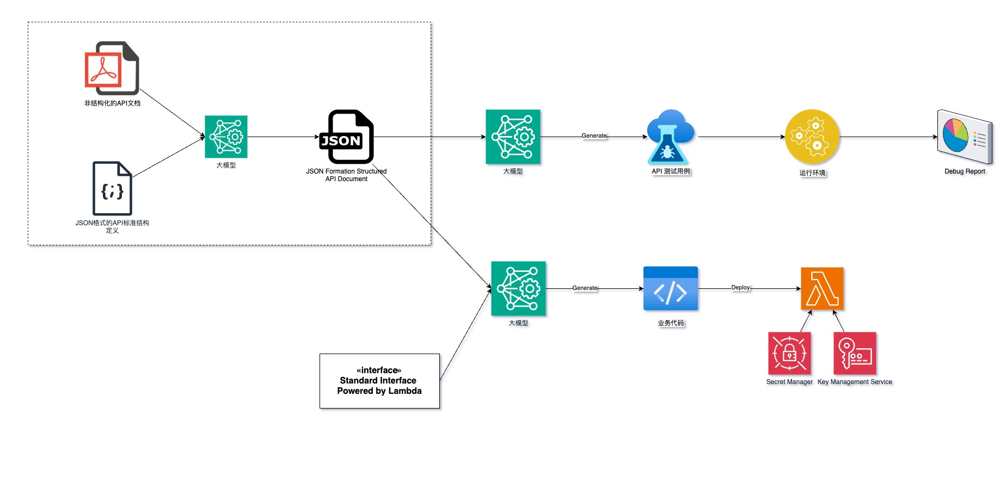
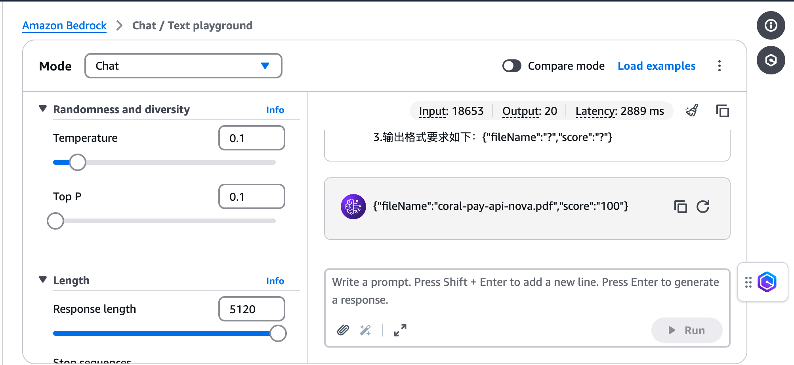
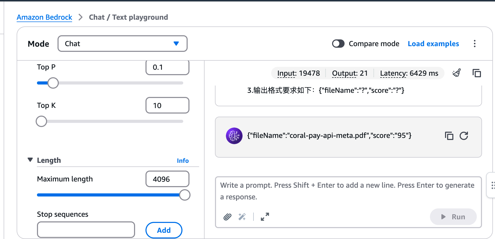

# 通过AI助手来生成第三方API接入代码的生成

## 背景

在电商行业，有大量的物流公司，或者供应商要对接。以快递公司为例，如果直接对接快递公司，每家快递公司的接口协议会有差异，涉及到大量API调用的转换，以及认证方式和加解密的开发工作。
分发给不同快递公司的订单数据在业务上类似的，例如：

收件人：姓名，电话（隐私号码），地址；
快递明细：圆领T恤 黑色 XXL 2件；
寄件人：姓名，电话，地址；

## Solution Overview

## Implement Scope

## 需要解决的技术问题

* 能够识别API参数的含义，与标准参数做映射
* 能够识别API的技术协议，例如是HTTPS JSON，还是HTTPS XML等
* 能够识别加密解密算法
* 能够识别签名算法
* 能够识别API编排
    * 有些API是可以直接调用下单的
    * 有些API需要份两步，第一步获取一个单号，第二步，使用获取到的单号+业务参数下单
* 能够按照非业务约束来实现特性
    * 例如，记录日志，日志脱敏，控制超时时间等

## 期望实现的效果

* 能够根据标准快递单信息，生成测试用例，用来验证生成的转换代码是否达到预期的要求
* 通过给出API文档，能够生成相应的接口调用代码

## 通过标准中间结果桥接

问题清单， 尽可能使用选择题和是非题，如果是填空题，选择从文档中直接可以抓取的内容

* 这份API文档，是针对那种业务类型？请选择正确的答案
    * POS支付
    * 银行账户转账
    * 话费/流量充值
* 这份API文档描述的接口的baseURL是什么？请给出正确的答案
* 这份API文档描述的接口调用协议是什么？请给出正确的答案
    * HTTP
    * HTTPS
    * TCP/IP
    * 其他
* 是否使用了加解密算法？
* 加解密的算法是什么？
    * RSA
    * 其他

## 分段的好处

* 每一段，可以用不同的解决方案来解决问题，即便是都用大模型，也可以用不同的大模型解决。
* 即使是上一个环节的输出没有达到预期的效果，可以通过人工对结果的调整，作为下一个环节的标准输入，避免上一个环节的不准确性对下一个环节产生影响。
* 每个环节可以独立开发。

## 对结果的判定标准
* 通过人工判断
* 通过预设的标准结果来判定
* 通过不同的模型来对结果做判定
* 通过行业的标准工具来判定

## 自定义目标格式的测试结果 😓

### MTN API 文档的解析结果
[MTN API 文档解析.md](infra/third-api/customer-standard/mtn-api/api-convert-result.md)

### CoralPay API 文档的解析结果
[CoralPay API 文档解析.md](infra/third-api/customer-standard/coral-pay-api/api-convert-result.md)

## 通过大模型对解析结果打分 😓

### 指令
coral-pay-api-nova.pdf，coral-pay-api-meta.pdf，coral-pay-api-claud.pdf 三个文档，是根据CoralPay的API文档，按照 api-definition-v2.pdf 生成的。请判断，这三个文档中，哪个文档是最符合要求，且最准确的，请给出文件名称。要求如下：
1.仅输出文档名称，无需输出判断过程。
2.如果匹配度得分满分是100分，最匹配的文档的得分是多少？
3.输出格式要求如下：{"fileName":"?","score":"?"}

### Nova的输出结果
{"fileName":"coral-pay-api-nova.pdf","score":"100"}

### Claude的输出结果
{"fileName":"coral-pay-api-meta.pdf","score":"95"}

## 通过大模型将API文档转换成通用标准结构 😄
* Swagger通用结构，例如：SwaggerHub https://app.swaggerhub.com/hub
* Postman结构

### 转换成postman可以识别的导入脚本
* 指令
  * 请根据提供的的API文档，生成可以导入到postman中的脚本。
  * 要求：
  * 1.仅输出脚本，不输出其他任何信息。
  * 2.务必要输出完整的脚本，不能应为长度限制截断脚本。
  * 3.必须遵守 Postman Collection 的格式。
  * 4.请求体的格式必须与文档中描述的一致，例如json或者xml等。
  * 5.如果文档中的请求参数有样例，生成的请求体中的参数对应的值，请使用文档中提供的样例。

#### Coral Pay API 识别和导入

[Coral Pay API Doc](./infra/third-api/api-docs/CoralPay%20Interbank%20Payment%20(CIP)%20API%20Document%20v1.2.3-1_1.pdf)

[通过Nova识别出导入到Postman中的JSON](./infra/third-api/postman/coral-pay-postman.json)

[导入到Postman中的结果](https://cloudy-crater-257632.postman.co/workspace/My-Workspace~b0d1e41d-eaee-4eeb-8ccb-930c2bab9516/collection/2263480-cdd66d3e-0af5-474c-9407-2c0b16d33791?action=share&creator=2263480)

### 转换成Swagger可以识别的导入脚本
* 指令
  * 请根据提供的的API文档，生成可以导入到Swagger中的脚本。要求如下：
    * 务必遵守 https://swagger.org.cn/specification/v2/ 的规范。完整识别请求参数中的header，body已经响应结果。
    * 请求体的格式必须与文档中描述的一致，例如json或者xml等。
    * 如果文档中的请求参数有样例，生成的请求体中的参数对应的值，请使用文档中提供的样例。
    * 如果请求参数和响应结果是xml，请务必保证导入到Swagger后，可以被识别。请务必生成example的数据。
    * 给出的API文档中不会有敏感信，是一些样例数据。如果有敏感内容，请用'#'代替，避免被blocked。
    * 如果标准格式是yaml，请将yaml格式转换成json进行输出，避免因为输出结果超过限制被blocked。
    * 仅输出脚本，不输出其他任何信息，以方便导入到工具中。
    * 务必要输出完整的脚本，不能应为长度限制截断脚本。
    
#### Coral Pay API 识别和导入（JSON格式）

[Coral Pay API Doc](./infra/third-api/api-docs/CoralPay%20Interbank%20Payment%20(CIP)%20API%20Document%20v1.2.3-1_1.pdf)

[通过Nova识别出的yaml或者json文档](./infra/third-api/swagger/coral-pay-swagger.json)

[导入到SwaggerHub之后的在线API文档](https://app.swaggerhub.com/apis/abc-7cc/coral-pay_interbank_payment_api/1.2.3)

#### MTN API 识别和导入（XML格式）

[MTN API Doc](./infra/third-api/api-docs/MTN-NG_ERS_HOSTIF%20API%20Specification.pdf)

[通过Nova识别出的yaml或者json文档](./infra/third-api/swagger/MTN-swagger.json)

[导入到SwaggerHub之后的在线API文档](https://app.swaggerhub.com/apis/abc-7cc/ers-3600_hostif_api/1.0.1)

#### UBA API 识别和导入 （JSON模式）

[UBA API Doc](./infra/third-api/api-docs/PAYOUT%20UBA-UBA.pdf)

[通过Nova识别出的yaml或者json文档](./infra/third-api/swagger/UBA-swagger.json)

[导入到SwaggerHub之后的在线API文档](https://app.swaggerhub.com/apis/abc-7cc/uba-open_banking_api/1.0.0)
